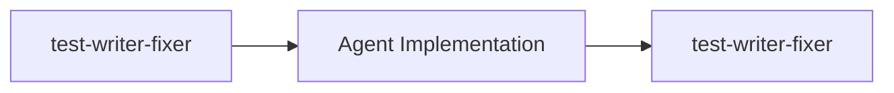
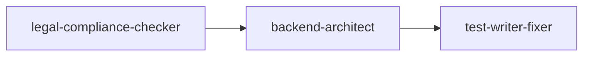
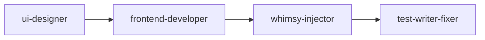

# 🤖 Guide d'Utilisation des Agents Claude - Qualiopii

Ce guide explique comment utiliser efficacement le système d'auto-activation des agents spécialisés dans le contexte du projet Qualiopii.

## 📋 Vue d'ensemble

Le système intelligent d'agents s'active automatiquement selon le contexte de votre demande, en tenant compte des spécificités de Qualiopii :
- **TDD obligatoire** 
- **Conformité Qualiopi critique**
- **Architecture multi-tenant**
- **Stack Nuxt 3 + AdonisJS**

## 🎯 Agents Disponibles

### 🔴 Agents Critiques (Activation Automatique Prioritaire)

#### `legal-compliance-checker` 
**🏛️ Conformité Légale - PRIORITÉ MAXIMALE**
- **Auto-activation** : Dès qu'un mot-clé Qualiopi/RGPD est détecté
- **Usage** : Tout ce qui touche aux 32 indicateurs Qualiopi, RGPD, données personnelles
- **Exemples déclencheurs** :
  ```
  ✅ "Implémenter la gestion des indicateurs Qualiopi"
  ✅ "Créer le système de consentement RGPD" 
  ✅ "Préparer l'audit de conformité"
  ```

#### `test-writer-fixer`
**🧪 Tests TDD - OBLIGATOIRE APRÈS TOUT CODE**
- **Auto-activation** : Après chaque modification de code
- **Usage** : Écriture de tests, maintenance de la couverture, TDD strict
- **Exemples déclencheurs** :
  ```
  ✅ "Implémenter la fonctionnalité X" → Tests d'abord !
  ✅ "Fixer le bug Y" → Tests de régression requis
  ✅ "Refactoriser le module Z" → Validation des tests
  ```

### 🟠 Agents Techniques Principaux

#### `backend-architect`
**⚙️ Architecture Backend AdonisJS + Multi-tenant**
- **Auto-activation** : API, base de données, architecture serveur
- **Usage** : Design d'APIs, modèles de données, sécurité multi-tenant
- **Exemples déclencheurs** :
  ```
  ✅ "Créer l'API des sessions de formation"
  ✅ "Optimiser les requêtes multi-tenant"
  ✅ "Implémenter l'authentification OAuth"
  ```

#### `frontend-developer` 
**🎨 Développement Frontend Nuxt 3**
- **Auto-activation** : UI, composants, interface utilisateur
- **Usage** : Composants Vue, pages Nuxt, stores Pinia, responsive design
- **Exemples déclencheurs** :
  ```
  ✅ "Créer le dashboard des indicateurs"
  ✅ "Développer le formulaire d'inscription"  
  ✅ "Optimiser l'interface mobile"
  ```

### 🟡 Agents Spécialisés (Activation Contextuelle)

#### `whimsy-injector`
**✨ Expérience Utilisateur Délicieuse**
- **Auto-activation** : Après création d'UI/UX
- **Usage** : Animations, micro-interactions, états de chargement amusants
- **Chaîne** : `frontend-developer` → `whimsy-injector`

#### `api-tester`
**🔍 Tests d'API et Performance** 
- **Auto-activation** : Changements d'API, préoccupations de performance
- **Usage** : Tests de charge, validation de contrats, optimisation

#### `sprint-prioritizer`
**📊 Gestion des Sprints 6 Jours**
- **Auto-activation** : Planification, priorisation, gestion du backlog
- **Usage** : Priorisation des fonctionnalités, résolution de conflits de scope

## 🔄 Chaînes d'Agents Automatiques

### Chaîne TDD (Obligatoire)

**Déclenchée par** : Toute modification de code

### Chaîne Qualiopi (Critique)

**Déclenchée par** : Fonctionnalités de conformité Qualiopi

### Chaîne UI/UX Complète

**Déclenchée par** : Demandes d'interface utilisateur

## 🎨 Exemples d'Usage Pratique

### Scénario 1: Nouvelle fonctionnalité Qualiopi
```bash
👤 Utilisateur: "Je veux implémenter le tracking des indicateurs Qualiopi avec audit trail"

🤖 Système: 
✅ Auto-activation: legal-compliance-checker (Priorité: 100)
✅ Auto-activation: backend-architect (Priorité: 90) 
✅ Auto-activation: test-writer-fixer (Priorité: 95)

📋 Séquence:
1. legal-compliance-checker vérifie la conformité
2. backend-architect conçoit l'architecture
3. test-writer-fixer crée les tests d'abord
4. Implémentation avec TDD strict
```

### Scénario 2: Interface utilisateur
```bash
👤 Utilisateur: "Créer un dashboard responsive pour les formateurs"

🤖 Système:
✅ Auto-activation: frontend-developer (Priorité: 85)
✅ Auto-activation: whimsy-injector (Priorité: 70, en chaîne)
✅ Auto-activation: test-writer-fixer (Priorité: 95)

📋 Séquence:
1. test-writer-fixer écrit les tests du dashboard
2. frontend-developer implémente l'interface  
3. whimsy-injector ajoute des interactions délicieuses
4. test-writer-fixer valide l'implémentation
```

### Scénario 3: Bug critique
```bash
👤 Utilisateur: "Bug critique: les données RGPD des apprenants sont exposées"

🤖 Système:
🚨 Auto-activation: legal-compliance-checker (Priorité: 130 - URGENCE)
✅ Auto-activation: backend-architect (Priorité: 100)
✅ Auto-activation: test-writer-fixer (Priorité: 115)

📋 Actions immédiates:
1. Évaluation urgente de la conformité RGPD
2. Architecture sécurisée pour la correction  
3. Tests de sécurité complets avant déploiement
```

## ⚙️ Configuration Personnalisée

### Modifier les Seuils d'Activation
Éditez `.claude/agent-triggers.yaml` :

```yaml
# Exemple: Augmenter la sensibilité pour les tests
test-writer-fixer:
  confidence_threshold: 0.75  # Par défaut: 0.85
  priority: 100              # Par défaut: 95
```

### Ajouter des Mots-Clés Personnalisés
```yaml
# Exemple: Ajouter des termes métier spécifiques
legal-compliance-checker:
  auto_activate_on:
    keywords:
      - "bilan pédagogique"
      - "cpf" 
      - "datadock"
      - "certification qualité"
```

### Créer des Chaînes d'Agents Personnalisées
```yaml
agent_chains:
  formation_chain:
    sequence: ["legal-compliance-checker", "backend-architect", "frontend-developer"]
    condition: "session_management"
    mandatory: true
```

## 🔍 Debugging et Monitoring

### Voir les Activations en Temps Réel
```bash
# Activer les logs détaillés
export CLAUDE_AGENT_DEBUG=true

# Ou dans agent-triggers.yaml
dev_settings:
  debug_mode: true
  log_triggers: true
```

### Tester le Système de Routing
```bash
node .claude/agent-router.js
```

### Métriques de Performance
Le système track automatiquement :
- ✅ Taux de succès des activations
- 📊 Précision contextuelle  
- ⚡ Performance des agents
- 🎯 Couverture de code maintenue

## 🚨 Conditions de Blocage (HALT)

Le système peut bloquer l'exécution dans ces cas :

### 🔴 TDD Obligatoire Non Respecté
```
⛔ HALT: Tests requis avant implémentation de fonctionnalité Qualiopi
Action: Écrire les tests d'abord avec test-writer-fixer
```

### 🔴 Risque RGPD Sans Révision Légale  
```
⛔ HALT: Modification des données personnelles sans révision conformité
Action: Activation forcée de legal-compliance-checker
```

### 🔴 Couverture de Tests Insuffisante
```
⛔ HALT: Couverture en dessous du seuil (95% pour Qualiopi, 80% général)
Action: Compléter les tests avant continuation
```

## 📚 Commandes Rapides

### Forcer l'Activation d'un Agent
```bash
# En commentaire dans votre demande
"Implémenter X // @force-agent:legal-compliance-checker"
```

### Désactiver un Agent Temporairement
```bash  
"Créer Y // @skip-agent:whimsy-injector"
```

### Activer Mode Debug
```bash
"Debug cette fonctionnalité // @debug-agents"
```

## 🎓 Bonnes Pratiques

### ✅ À Faire
- **Soyez explicite** : "Implémenter avec conformité Qualiopi" 
- **Mentionnez le contexte** : "Pour les données des apprenants"
- **Précisez les contraintes** : "Multi-tenant obligatoire"

### ❌ À Éviter  
- Demandes trop vagues : "Répare ça"
- Ignorer les recommandations TDD
- Contourner les agents de conformité

## 🆘 Support et Dépannage

### Agent Ne S'Active Pas ?
1. Vérifiez les mots-clés dans votre demande
2. Consultez le seuil de confiance dans la config
3. Activez le mode debug pour voir l'analyse

### Trop d'Agents Activés ?
1. Augmentez les seuils de confiance
2. Soyez plus spécifique dans vos demandes  
3. Utilisez les flags `@skip-agent`

### Performance Dégradée ?
1. Vérifiez les chaînes d'agents complexes
2. Optimisez les conditions d'activation
3. Surveillez les métriques de performance

---

**💡 Astuce** : Le système apprend de vos patterns d'usage. Plus vous l'utilisez avec des demandes claires, plus il devient précis dans ses recommandations d'agents !

Pour toute question, consultez la configuration dans `.claude/agent-triggers.yaml` ou activez le mode debug.